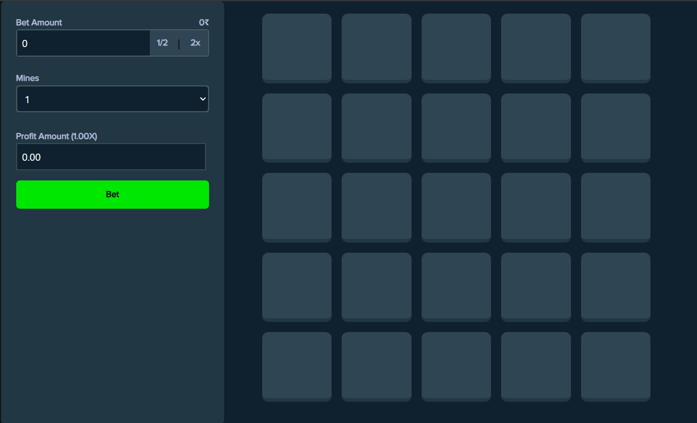
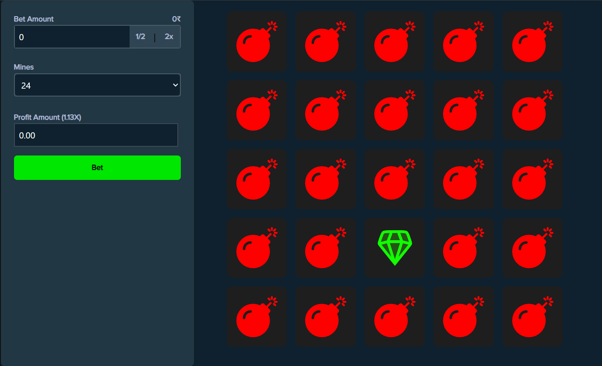

# Mine Game

## Live Link

https://minegame-by-jayvegad.netlify.app/

## About the Game

Mine Game is a faithful clone of the popular Minesweeper game from Stack. This project was developed as a learning exercise to improve React development skills and create a responsive user interface.

## Features

- Simple and intuitive gameplay
- Clean, responsive UI built with React
- Cross-platform compatibility

## Screenshots

## Platforms

This game is available as a web application, making it accessible on various platforms including:

- Desktop browsers (Chrome, Firefox, Safari, Edge)
- Mobile browsers on iOS and Android devices
- Tablets

## System Requirements

As a web-based game, Mine Game has minimal system requirements:

- A modern web browser
- Internet connection
- JavaScript enabled

## Development

This project was developed using React to create a responsive and interactive user interface. It serves as a practical exercise in front-end development and game logic implementation.

## How to Play

1. Click on a cell to reveal it
2. Numbers indicate how many mines are adjacent to that cell
3. Right-click (or long-press on mobile) to flag a suspected mine
4. Clear all non-mine cells to win!

## Contributing

This is a learning project, but suggestions and contributions are welcome. Please feel free to fork the repository and submit pull requests.

## License

MIT License

Copyright (c) [2024] [Jay Vegad]

Permission is hereby granted, free of charge, to any person obtaining a copy
of this software and associated documentation files (the "Software"), to deal
in the Software without restriction, including without limitation the rights
to use, copy, modify, merge, publish, distribute, sublicense, and/or sell
copies of the Software, and to permit persons to whom the Software is
furnished to do so, subject to the following conditions:

The above copyright notice and this permission notice shall be included in all
copies or substantial portions of the Software.

THE SOFTWARE IS PROVIDED "AS IS", WITHOUT WARRANTY OF ANY KIND, EXPRESS OR
IMPLIED, INCLUDING BUT NOT LIMITED TO THE WARRANTIES OF MERCHANTABILITY,
FITNESS FOR A PARTICULAR PURPOSE AND NONINFRINGEMENT. IN NO EVENT SHALL THE
AUTHORS OR COPYRIGHT HOLDERS BE LIABLE FOR ANY CLAIM, DAMAGES OR OTHER
LIABILITY, WHETHER IN AN ACTION OF CONTRACT, TORT OR OTHERWISE, ARISING FROM,
OUT OF OR IN CONNECTION WITH THE SOFTWARE OR THE USE OR OTHER DEALINGS IN THE
SOFTWARE.

## Acknowledgments

- Inspired by the classic Minesweeper game
- Built with React

---

Enjoy playing Mine Game and happy coding!
